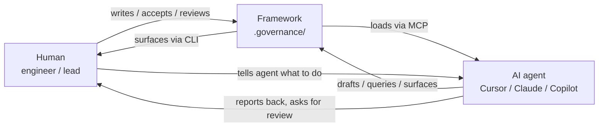
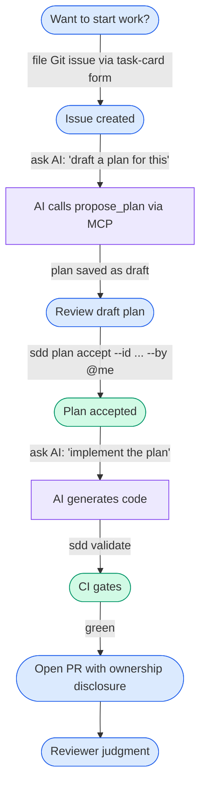

# USAGE — how humans and agents work the framework together

> This doc is for humans. It describes how to *use* sdd-plus-plus day-to-day. The AI's standing orders live in `.governance/instructions.md` — read that to understand the agent side of the contract.

---

## The mental model

Three actors, one shared workspace:



The framework is the shared workspace. Humans and agents both interact with it, but neither owns it alone. **Humans own decisions; agents draft and execute; the framework enforces the contract.**

---

## How agents learn the workflow

Two layers stack:

1. **`.governance/instructions.md`** — loaded once per session via the `get_instructions` MCP tool. It tells the agent the meta-protocol: when to challenge, what to author (and not), how to call other tools.
2. **MCP tools (via `sdd serve`)** — the API surface. Agents query for structured data: `get_capability`, `list_findings`, `get_progress`, `propose_plan`, `record_session_end`, etc.

Agents that have `sdd serve` configured load both at session start. They learn the rules from instructions.md and then use the tools to actually operate.

---

## Common flows by example

### Flow 1 — Human says: "sdd update-status"

What's expected:

1. The human's intent: snapshot the current session's progress.
2. The agent (or the human, equivalently) runs:
   ```
   sdd update-status --kind milestone --message "<summary of recent work>"
   ```
   or calls the MCP tool `record_progress(message="<summary>")` or `record_session_end(summary="<...>")`.
3. The framework appends the event to `.governance/.progress-log.yaml` and regenerates `progress.md`.
4. The next session loads `progress.md` and sees the trail.

**Agent's job:** translate the human's intent into the right CLI command or MCP call. If the human types "update status," the agent should *not* ask "what do you want to say?" — it should summarize the last N minutes of work and propose that summary, then let the human edit.

### Flow 2 — Human uses AI to draft a capability spec

This is going to happen. You cannot prevent humans from using AI to draft specs. What you *can* do is make sure validation catches problems the AI would otherwise introduce.

The agent's role:

1. Draft `capabilities/<id>/spec.yaml` from the human's request.
2. Populate every required field honestly. The schema requires `purpose` ≥ 100 chars, at least one `case`, at least one `forbidden` entry, `owner.human` with a real handle.
3. Hand back to the human for review.

**Critical:** the `owner.human` field must be a real human handle (validated by pattern `^@[a-zA-Z0-9_-]+$`). The AI may suggest a value but the human must confirm it before commit. The AI assistance disclosure on the PR records that the spec was AI-drafted.

The defense isn't "AI can't write specs." The defense is "schema validation catches what matters, and human ownership is recorded in writing." Trust but mechanically verify.

### Flow 3 — Human says: "draft a plan for issue BBS-127"

The agent flow:

1. Read the issue body (the task).
2. Call `get_capability(<task's parent capability>)` via MCP — get the contract.
3. Call `list_findings(capability=<parent>)` — surface known gotchas.
4. Call `get_coding_standards()` — load tribal knowledge.
5. Call `get_principles()` if not loaded yet this session.
6. **Populate the `challenge` block** with honest concerns and alternatives. This is the AI's required pushback step.
7. Call `propose_plan(task_id, capability, understood_request, concerns, alternatives_considered, in_scope, non_goals, body)` — saves status: draft.
8. Tell the human: "Drafted at .governance/plan/BBS-127-plan-001.plan.yaml. Run `sdd plan accept --id BBS-127-plan-001 --by @your-handle` after review."

**The agent cannot self-accept.** `propose_plan` saves drafts only. Acceptance requires a human running the CLI.

### Flow 4 — Agent discovers something during work

The agent should *not* keep the discovery in chat history. It should:

1. Call `propose_finding(title, finding, related_capability, severity, evidence)` via MCP.
2. The framework saves a `wiki/findings/<slug>.yaml` with `status: suspected`, `ai_assistance: suggested`.
3. The human sees it in `sdd findings list --status suspected`, verifies, and edits the file to advance status to `confirmed`.

This is how knowledge accumulates. Future sessions load the finding via `list_findings(capability=...)` and benefit from the lesson.

### Flow 5 — Agent finishes a session

Before disconnecting:

1. Call `record_session_end(summary="<1-3 sentences: what was attempted, what landed, what's left>")`.
2. The framework appends the event and refreshes `progress.md`.
3. The next session (or human) reads `get_progress()` and picks up cleanly.

### Flow 6 — Human reviews a plan and rejects it

If the human reads a plan and disagrees with the approach:

1. Edit `plan/<id>.plan.yaml` and set `status: rejected`.
2. Add a markdown note in `notes:` explaining why.
3. File a new task or have the agent draft a fresh plan.

The rejected plan is kept for provenance — future audits can see what was proposed and declined.

---

## What humans should and shouldn't ask the agent to do

**Ask the agent to:**

- Draft a plan against an existing capability.
- Generate code that conforms to the active plan.
- Write tests that satisfy named case_ids from the capability spec.
- Surface candidate findings (`propose_finding` MCP tool) when something unexpected comes up.
- Summarize and record progress (`record_progress`, `record_session_end`).
- Query the framework state (capabilities, findings, plans, registry).

**Don't ask the agent to:**

- **Accept its own plan.** Acceptance requires a human via `sdd plan accept --by @<handle>`. If you ask the agent to do it, it should refuse.
- **Author `wiki/principles.md`, `arch_spec.md`, or capability `spec.yaml` files unsupervised.** Drafting is allowed; the human must verify and commit. The PR template's ownership disclosure records who really authored each piece.
- **Confirm findings.** Agents file `suspected`; humans confirm.
- **Modify `.governance/_schemas/`** — that's framework-level. Schema changes ship with the `sdd-plus-plus` tool, not via per-repo edits.

---

## What to type vs. what to ask the AI



The human types CLI commands at three points: filing the issue (via form), accepting the plan, and opening the PR. Everything else is conversational with the AI. The AI translates the conversation into MCP calls and code generation. The framework records the chain.

---

## A note on token economy

When sessions get long, context bloats and quality drops. Two mechanisms keep this under control:

- **Progress.md as intentional compaction.** Don't re-load the whole repo every session. Load `progress.md` via `get_progress` — it's a token-efficient snapshot of in-flight state.
- **MCP tools instead of file grep.** When you need a specific spec or finding, call the tool. The agent gets a small structured response instead of paging through directories.

If a session has been running long and you sense the AI is drifting, type:

```
sdd update-status --kind session-end --message "<paste a tight summary>"
```

Then start a fresh session. The new session loads `progress.md` and is back on task without your full conversation history.

---

## Where to look when something breaks

- `sdd validate` shows schema-level problems
- `sdd doctor` shows adoption-level gaps
- `sdd progress` shows the recent activity trail
- The PR template's compliance checklist tells you what CI is checking
- `.governance/wiki/findings/` is where known gotchas live — search before asking the team
