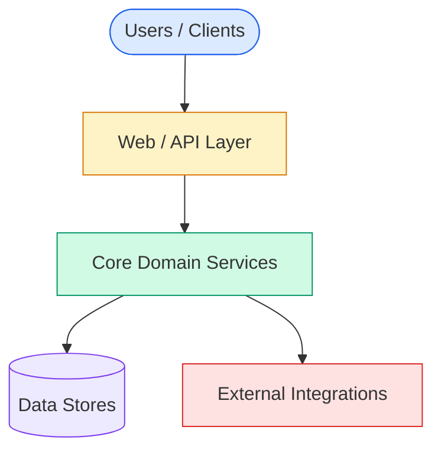
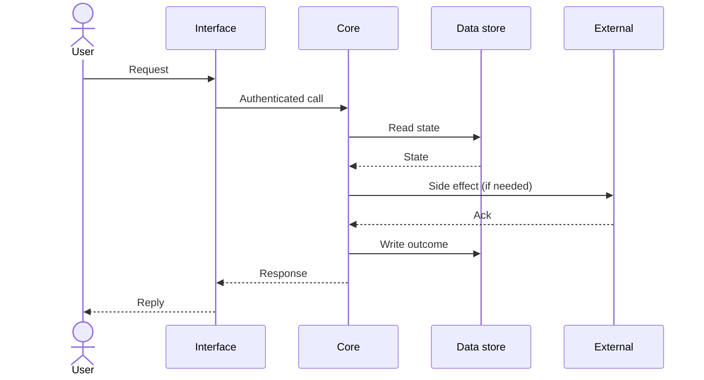

# Architecture spec

> The whole-system view. Where capabilities, integrations, data flow, and non-functional constraints fit together. Capabilities have their own specs (`capabilities/<id>/spec.md`); this doc is what binds them.
>
> Update this file when a major architectural choice changes. Small additions (a new capability of an existing shape) usually do not need an arch_spec edit.

## System purpose

> One paragraph. What does this system do, for whom, and what's the minimum it must always do? If the system stopped working tomorrow, what would users lose?

TODO — describe your system in 3–5 sentences.

## Top-level architecture

> Replace the diagram above with your system's component view. Use Mermaid so it renders in GitHub, Cursor, and most IDEs. Aim for 5–10 boxes, not 50 — this is the wide-angle view.

## Capabilities

The capabilities listed in `capabilities/REGISTRY.yaml`, grouped by layer:

- **Interface layer:** TODO — list capabilities that handle ingress/egress
- **Core layer:** TODO — list capabilities that implement the domain logic
- **Data layer:** TODO — list capabilities that persist and retrieve state
- **Integration layer:** TODO — list capabilities that talk to external systems

Each capability has its own `spec.md`. Cross-capability invariants live below.

## Cross-cutting invariants

Properties that hold across the whole system, not just within one capability:

- **TODO — Idempotency:** describe the guarantee, e.g. "All write operations are idempotent against retries within a 24h window."
- **TODO — Authorization:** "Every request is authenticated and authorized before reaching the domain layer."
- **TODO — Observability:** "Every domain operation emits a structured event with trace_id, capability_id, outcome."

## Data flow

> Replace with your canonical request flow. If the system has multiple major flows (synchronous + async, ingest + serve, batch + stream), include one diagram per flow.

## Non-functional requirements (system-wide)

- **Availability:** TODO — target uptime
- **Latency:** TODO — p95 target end-to-end
- **Throughput:** TODO — peak load
- **Security:** TODO — auth model, encryption at rest/in transit, data classification
- **Privacy / compliance:** TODO — regulatory regime, retention, deletion guarantees
- **Cost ceiling:** TODO — monthly budget if relevant

Capability-level NFRs live in each capability's `spec.md` frontmatter under `non_functional`.

## Technology choices

| Layer | Choice | Why |
|---|---|---|
| Runtime | TODO | TODO — why this over alternatives |
| Persistence | TODO | TODO |
| Message bus | TODO | TODO |
| Observability | TODO | TODO |
| Deployment | TODO | TODO |

When changing a row, update with an ADR explaining the migration plan.

## Failure modes and recovery

The top failure modes the system is designed to survive:

1. **TODO — failure mode 1.** What happens, what the recovery is.
2. **TODO — failure mode 2.**
3. **TODO — failure mode 3.**

Failure modes the system is *not* designed to survive (acknowledged risk, not blind spot):

- TODO

## What this doc is NOT

- Not a list of capabilities — that's `capabilities/REGISTRY.yaml`.
- Not a list of decisions — those are individual ADRs.
- Not a tutorial — adopters read `.governance/wiki/principles.md` and `.governance/instructions.md` first.

When in doubt: if it's about how a single capability behaves, it goes in that capability's `spec.md`. If it's about how multiple capabilities or external systems combine, it goes here.
