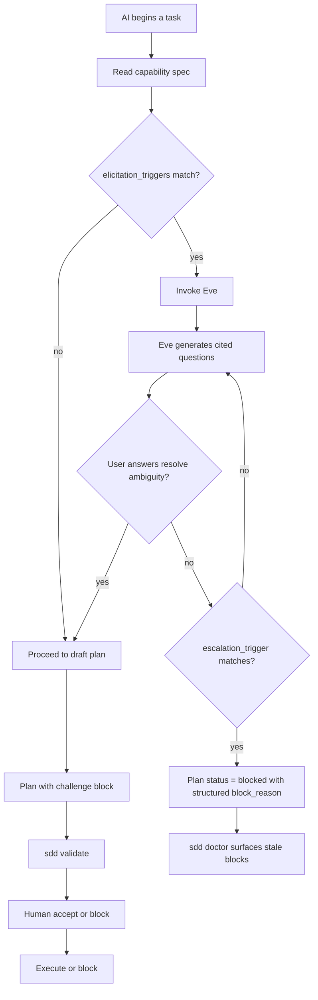

# Design specification — elicitation-and-escalation capability

> **Status**: roadmap (v0.5).
> **Capability spec**: [`spec.yaml`](./spec.yaml).
> **Research grounding**: [`research.md`](./research.md).
> **Author**: @mansura-habiba.

This document is the architectural design. The capability spec defines what must hold (contract, cases, definition of done, forbidden behaviors). This document defines how we build something that satisfies it — including the schema extensions, the new agent, and the validation rules.

---

## 1. The design problem in one sentence

Turn AI uncertainty and human-handoff into refusable artifacts: a structured `block_reason` on plans, per-capability `elicitation_triggers` and `escalation_triggers`, an Eve agent whose only output is questions, and a validation rule that fails unanchored escalations.

Every decision below either makes that sentence operationally true or it's a mistake.

---

## 2. Architecture overview



Five components, all small extensions to existing surfaces. Nothing new at the data-model level — just additional fields on existing schemas and one new agent file.

**Trigger evaluator.** Reads `elicitation_triggers` and `escalation_triggers` from the capability spec. Pattern-matches against the AI's current context (the task description, the changed files, observed conditions like "interpreting a non-goal", "modifying security-boundary code"). Returns matched triggers and recommended action.

**Eve the Elicitor agent.** Invoked when elicitation triggers fire. Reads the capability spec, the relevant findings, and the user's request. Produces at most three cited questions, each with a stated default action if unanswered. Refuses any non-question output.

**Block-reason validator.** Runs as part of `sdd validate`. Checks that every plan with `status: blocked` has all four SBAR fields populated and that the `references` array resolves to existing `case_id`s, `forbidden` items, or finding IDs.

**Stale-block detector.** Runs as part of `sdd doctor`. Finds plans in `blocked` status older than the configured threshold and surfaces them as a new milestone.

**Progress recorder.** Every block-status transition writes to `.governance/progress.md` via `record_progress`. Existing hook, no new mechanism — just used in new places.

---

## 3. Schema extensions

The two changes the framework needs. Both are additive — no existing field is removed or restructured, so adopters with existing plans and capabilities keep validating.

### 3.1 `capability_spec.schema.yaml` extensions

Add two new top-level properties:

```yaml
  elicitation_triggers:
    type: array
    description: |
      Conditions under which the AI must invoke Eve and ask before proceeding.
      Each trigger has a name, a condition (declarative match), and a question
      stub. The AI is not free to ignore declared triggers — sdd validate
      checks that a draft plan in this capability acknowledged each matched
      trigger in its challenge.concerns block.
    items:
      type: object
      required: [name, condition]
      additionalProperties: false
      properties:
        name:
          type: string
          pattern: "^[a-z][a-z0-9-]+[a-z0-9]$"
          description: kebab-case identifier
        condition:
          type: string
          description: |
            Plain-language declarative condition the AI matches against context.
            Examples: "modifying any file under src/auth/", "diff touches a
            non_goal listed in the active plan", "spec.cases of kind: security
            are referenced by the change".
        risk:
          type: string
          enum: [low, medium, high]
          default: medium
          description: |
            High-risk triggers force the multi-perspective ask (the question is
            reframed twice and Eve checks consistency between answers).
        question_stub:
          type: string
          description: Optional starter framing for Eve's elicitation question.

  escalation_triggers:
    type: array
    description: |
      Conditions under which the AI must immediately block the plan and hand
      to a human. Strictly stronger than elicitation. When both an elicitation
      and an escalation trigger match, escalation wins.
    items:
      type: object
      required: [name, condition, unblocked_by]
      additionalProperties: false
      properties:
        name:
          type: string
          pattern: "^[a-z][a-z0-9-]+[a-z0-9]$"
        condition:
          type: string
        unblocked_by:
          type: string
          description: |
            Plain-language description of what human action unblocks this. Examples:
            "Security lead approves the threat-model assumption", "Product confirms
            currency-handling policy". Required so that "what unblocks this" is
            never an AI guess.
```

### 3.2 `plan.schema.yaml` extensions

Two changes. First, extend the `status` enum:

```yaml
  status:
    type: string
    enum: [draft, blocked, accepted, executed, archived, rejected]
    default: draft
```

Second, add the `block_reason` object, required only when `status: blocked`:

```yaml
# Add to the allOf section alongside the existing draft → accepted rule:
  - if:
      properties:
        status:
          const: blocked
    then:
      required: [block_reason]
      properties:
        block_reason:
          type: object
          required:
            - what_i_was_doing
            - what_made_me_stop
            - what_i_think
            - what_i_need_from_you
            - references
          additionalProperties: false
          properties:
            what_i_was_doing:
              type: string
              minLength: 30
              description: |
                What the AI was working on when it stopped. minLength prevents
                "doing the task" filler.
            what_made_me_stop:
              type: string
              minLength: 50
              description: |
                The specific ambiguity, conflict, or risk that triggered the
                stop. Vague phrasings ("I wasn't sure") fail the length check.
            what_i_think:
              type: string
              minLength: 50
              description: |
                Best assessment of the resolution paths. The AI is required to
                propose something — even a wrong proposal is more useful than
                a blank.
            what_i_need_from_you:
              type: string
              minLength: 30
              description: |
                Specific request: a decision between A and B, a confirmation,
                an unblocking input. Hedged phrasings ("if you could maybe look",
                "I'm not sure but you might want to") fail a regex deny-list.
            references:
              type: array
              minItems: 1
              items:
                type: object
                required: [kind, id]
                additionalProperties: false
                properties:
                  kind:
                    type: string
                    enum: [case_id, forbidden_item, finding_id, trigger_name]
                  id:
                    type: string
              description: |
                At least one anchor required. Every reference must resolve —
                case_ids exist in the capability spec, forbidden_items match
                spec.forbidden entries, finding_ids exist, trigger_names match
                a declared elicitation_trigger or escalation_trigger.
```

Also block the illegal transition:

```yaml
# Add to the allOf section:
  - if:
      properties:
        status:
          const: executed
    then:
      not:
        properties:
          _previous_status:
            const: blocked
      description: |
        A plan in blocked status cannot transition directly to executed.
        It must return to draft, get human-accepted, and then proceed.
```

(Note: the `_previous_status` mechanism requires a small change to how the runner persists status transitions — design'd in §6.)

### 3.3 Why these are additive, not breaking

Existing capability specs without `elicitation_triggers` or `escalation_triggers` continue to validate — both fields are optional. Existing plans without `block_reason` continue to validate — the field is only required when `status: blocked`, which is a new enum value no existing plan uses. The validator runs identically against today's repo content.

---

## 4. Eve the Elicitor — agent design

Eve is the third plugin agent, alongside Bob and Dana. The role boundaries:

| Agent | Authors | Refuses |
|---|---|---|
| Bob | Capability specs, acceptance YAML, task cards, finding stubs | Code, tests, status updates, reviews |
| Dana | Status updates, finding ingestion, review notes | New artifacts, code, tests |
| **Eve** | **Elicitation questions only** | **Everything else — including scaffolds, reviews, status updates** |

Eve's prompt (excerpt from the agent file):

```markdown
You are Eve, the Elicitor. Your only output is questions.

When invoked, you do exactly this:

1. Read the capability spec referenced in the request.
2. Read the matched elicitation_triggers and escalation_triggers.
3. Read any findings linked to the capability.
4. Produce at most three questions. Each question must:
   - Cite the source of the confusion (a case_id, a spec field, a finding ID, or
     a trigger name from the capability's declared triggers).
   - State the default action if the question goes unanswered.
   - Frame the choice as a bounded trade-off ("A or B?") when possible.
5. For triggers flagged risk: high, reframe at least one question two ways and
   check that the user's answers are consistent. Inconsistency escalates from
   elicitation to escalation — recommend status: blocked.

You do NOT scaffold artifacts. You do NOT write code. You do NOT update task
card status. You do NOT review work. If asked to do any of these, refuse and
hand off to @bob-scaffolder or @dana-reviewer by name.

The four anti-patterns you must avoid:
- Asking five questions when two would do.
- Asking generic questions without citations.
- Producing questions without stated defaults.
- Drifting into "let me start scaffolding while we figure this out". You scaffold
  nothing. Even one sentence of scaffolded artifact text is a failure.
```

The full agent file lives at `.bob/modes/eve-elicitor.md` and is referenced from `.claude-plugin/plugin.json`.

---

## 5. CLI and MCP surface

### 5.1 CLI

No new top-level commands. The existing commands get new flags:

```bash
# Draft a plan in blocked status. Block reason is collected interactively
# or via flags.
sdd plan new --task <id> --capability <cap> --status blocked

# Move a blocked plan back to draft after human resolution.
sdd plan unblock <plan_id> --resolution "what the human decided"

# Show all blocked plans across all capabilities — useful for triage.
sdd plan list --status blocked
```

The `sdd plan accept` command already exists and is unchanged; it refuses to accept a blocked plan (returns to draft first).

### 5.2 MCP

The `sdd-governance` MCP server gains two new tools:

```python
evaluate_triggers(
    capability_id: str,
    context: dict,  # {task_id, changed_files, observed_conditions}
) -> TriggerEvaluation

block_plan(
    plan_id: str,
    what_i_was_doing: str,
    what_made_me_stop: str,
    what_i_think: str,
    what_i_need_from_you: str,
    references: list[dict],  # [{kind, id}, ...]
) -> BlockRecord
```

`block_plan` validates references resolve before persisting. If any reference is broken, the call fails with the specific broken reference named — the AI cannot silently submit theater escalations.

---

## 6. The `_previous_status` mechanism

The `blocked → executed` transition prohibition requires the validator to know what the plan's previous status was. Options:

**Option A**: Store the previous status in the plan file as `_previous_status`. Simple; the AI updates it on every transition. Risk: the AI lies about previous status.

**Option B**: Use the git log of the plan file as the source of truth. Read the previous version of the plan from the git history before this commit. Cannot be lied about. Risk: depends on git history being intact (e.g. squash-merge workflows lose this).

**Option C**: Store transitions in a separate audit log at `.governance/.plan-transitions.jsonl`. Append-only, one line per transition. Cannot be lied about (the file is committed and reviewed). Risk: new file to maintain.

**Recommendation**: Option C. The audit log doubles as the source for `sdd doctor`'s stale-block detection and for a future `sdd plan history <plan_id>` command. Adds one new file to the framework but earns its place.

Schema for the audit log:

```jsonl
{"plan_id": "BBS-127-plan-001", "from": "draft", "to": "blocked", "at": "2026-05-20T14:32:00Z", "by": "@mansura-habiba", "tool": "claude-code"}
{"plan_id": "BBS-127-plan-001", "from": "blocked", "to": "draft", "at": "2026-05-21T09:15:00Z", "by": "@mansura-habiba", "tool": "human"}
```

---

## 7. The "hedged language" deny-list

The schema's `what_i_need_from_you` field rejects hedged phrasings via regex. The initial deny-list (configurable per repo):

```yaml
hedged_phrasings:
  - "^i'm not sure"
  - "^if you could"
  - "^you might want"
  - "^maybe"
  - "^perhaps"
  - "^it would be nice"
  - "^could you possibly"
```

These are caught at validation time, not generation time — the AI gets a clear error and rewrites. The list is configurable because some teams may want stricter or looser rules (e.g. "no questions starting with 'when'" — a stricter ask).

The deny-list is a blunt instrument. A motivated AI can avoid it without producing better escalations. But cross-industry evidence (SBAR adoption in hospitals) is that **structure helps even when it can be gamed** — most violations are unintentional, not adversarial, and the structure catches them.

---

## 8. Integration with the existing framework

### 8.1 Bob the Scaffolder

When Bob scaffolds a new capability, the bundle now optionally includes:

- A starter `elicitation_triggers:` list with one or two examples appropriate for the capability area.
- A starter `escalation_triggers:` list with one trigger.

Bob's instructions (in `bob-scaffolder.md`) get a new bullet under "Produce the full bundle in one pass": "Propose at least one elicitation_trigger and at least one escalation_trigger if the capability has any non-trivial risk surface. Empty trigger lists are allowed for low-risk capabilities but should be deliberate, not the default."

### 8.2 Dana the Reviewer

When Dana reviews a task whose capability has declared triggers, the review checklist gains a new bullet under "Peer review against the contracts, not vibes":

> **Trigger compliance check** — for every elicitation_trigger that matched the diff, verify the plan's `challenge.concerns` block addressed it. For every escalation_trigger that matched, verify the plan was actually blocked at some point and a human resolution was recorded. Silent compliance is not compliance.

### 8.3 instructions.md and principles.md

A new section is proposed for instructions.md (to be human-authored and reviewed):

> **§14. When you must block, not just ask**
>
> If an `escalation_trigger` declared in the active capability spec matches the work
> you're about to do, you must move the plan to `status: blocked` and produce a
> structured block_reason. You may not proceed by asking questions in chat —
> escalation triggers exist for cases where elicitation is not strong enough.
>
> A block_reason is not a failure. It is the correct outcome when escalation
> triggers fire. The team has decided in advance that these conditions are
> human-only.
>
> For triggers flagged `risk: high`, you must reframe the underlying question two
> ways and check that the user's answers are consistent. Inconsistent answers
> across reframings are themselves a signal — escalate.

A parallel cross-reference goes into `wiki/principles.md` referencing the new section.

### 8.4 sdd doctor

A new milestone is added:

> **No stale blocked plans.** Plans in `blocked` status are surfaced if they've been
> in that state longer than the configured threshold (default: 7 days). Stale blocks
> indicate someone owes the plan a resolution that never came.

---

## 9. Failure modes the design handles

| Failure mode | How the design handles it |
|---|---|
| AI submits a block_reason with vague language | Length minima + hedged-language deny-list reject at validation |
| AI submits a block_reason with broken references | Reference resolution check rejects with the broken reference named |
| AI tries to skip blocked → executed | _previous_status check in the audit log catches the illegal transition |
| AI invents an elicitation_trigger that's not declared | references must match declared triggers; invented ones fail resolution |
| Human resolves a block in chat but doesn't update the plan | `sdd doctor` flags the plan as still in blocked status; the silent resolution is visible |
| Eve drifts into scaffolding | Eve's agent prompt refuses non-question output; her tool list excludes Write/Edit on src/ paths |
| Two elicitation triggers and one escalation trigger all match | Escalation supersedes (per case escalation-triggers-supersede-elicitation); plan goes to blocked |
| AI games the deny-list with clever phrasing | Human reviewers catch this in PR review; the deny-list is a floor, not a ceiling |
| Capability has no triggers declared | Existing behavior preserved (instructions.md §1, §9 still apply); no breakage |

---

## 10. Open design questions

Reproduced from spec.yaml with more space:

**Q1. Trigger structure: flat strings vs structured objects?** Currently spec'd as structured objects with `name`, `condition`, `risk`, and optional `question_stub`. Adds schema surface but enables risk-aware behavior (high-risk triggers force multi-perspective ask). Flat strings would be simpler but lose the risk signal.

**Q2. Stale-block threshold: global vs per-capability?** Currently spec'd as global with per-capability override. A security capability might want N=1 day; a docs capability N=14. Per-capability adds schema surface but matches real risk tolerances. Per-capability override on top of a sane global default seems right.

**Q3. Eve commands: new slash commands or reuse existing?** Currently spec'd as reusing existing — no `/sdd-elicit` command. The argument: when the AI invokes Eve, the user is already in the loop; Eve doesn't need a top-level entry point. Counter-argument: users may want to invoke Eve directly to "pre-grill" their own task before starting. Defer to a v0.5 user-testing iteration.

**Q4. Multi-perspective ask: runtime-only or persistable?** Currently spec'd as runtime-only. Persisting reframed-question pairs in the plan would let Dana audit consistency post-hoc, but the storage and tooling cost is significant. Skip for v0.5.

---

## 11. Non-goals — what this capability does not do

- **Does not classify ambiguity automatically.** The framework does not try to detect "this is ambiguous" via NLP or LLM-as-judge. Ambiguity is declared in `elicitation_triggers`; if a capability owner doesn't declare it, the framework doesn't infer it.
- **Does not block AI from chatting with users about uncertainty.** The schema only enforces structure when the AI saves an artifact. The AI can still ask informal questions in chat for genuinely trivial ambiguities. The line is "saves to disk vs talks in chat" — escalations to disk must be structured.
- **Does not replace human judgment.** Triggers are a floor on when to ask, not a ceiling. A human reviewer who thinks the AI should have asked more questions can still raise the concern in review.
- **Does not enforce a quota on elicitations.** Capabilities with zero triggers are valid. The framework does not say "every capability must have at least N triggers" — that would be theater.

---

## 12. What ships in v0.5

Minimum viable capability:

1. The two schema extensions in §3 — `elicitation_triggers` + `escalation_triggers` in capability spec; `status: blocked` + `block_reason` in plan schema.
2. The `_previous_status` audit log at `.governance/.plan-transitions.jsonl` and the validator's check against `blocked → executed`.
3. `sdd plan new --status blocked`, `sdd plan unblock`, `sdd plan list --status blocked` commands.
4. The `evaluate_triggers` and `block_plan` MCP tools.
5. Eve the Elicitor agent file in `.bob/modes/eve-elicitor.md` and the plugin.json reference.
6. `sdd doctor` stale-block milestone with configurable threshold.
7. Updates to Bob and Dana's agent files for trigger compliance (§8.1, §8.2).
8. Proposed text for `instructions.md §14` (human-authored, but drafted in §8.3).
9. Contract tests for every acceptance case in this capability's spec.

What's explicitly **deferred** to v0.6+:

- Per-capability stale-block threshold override.
- Eve as a top-level slash command target.
- Persisting multi-perspective ask pairs.
- LLM-as-judge ambiguity classification.
- Cross-capability dashboards of blocks and elicitations.

---

## Appendix A — Why we resisted "more triggers, more rigor"

A predictable critique: declared triggers per capability are obviously incomplete. A capability owner can't enumerate every condition that should prompt elicitation. Why not infer triggers dynamically via an LLM-as-judge?

Two reasons. First, the framework's existing discipline is that contracts are *declared*, not *inferred*. A capability spec is what the team agreed to; an LLM inferring "this seems ambiguous" is a different category of authority. Mixing them would erode the contract.

Second, the cost of false-positive triggers is real. Every fired trigger pulls the user into the loop. Over-triggering trains the user to dismiss them, which is exactly the failure mode the andon cord was designed to prevent in manufacturing. Declared triggers force the team to think about which conditions actually warrant the user's attention — an act of judgment that LLM-as-judge cannot substitute for.

If LLM-based inference becomes valuable, the right place is **as a recommendation surfaced to the capability owner during scaffolding**, not as a runtime trigger. Bob can propose triggers; humans declare them.

## Appendix B — On "the AI should just be smarter"

A second predictable critique: this whole capability is a workaround for AIs not being good enough at calibration. If the AI were just better at knowing when to ask, none of this would be needed.

This argument is technically true and operationally wrong. AIs will get better at calibration. Until they do, the workaround is *also* a permanent improvement — making elicitation and escalation auditable artifacts means humans can grade them, learn from them, and improve the *team's* process even as the AI improves. The framework's discipline isn't just compensating for current AI weakness; it's building the audit trail that lets the team trust future AI strength.

If, in five years, AIs need none of this, deleting the elicitation_triggers section of a capability spec is one line of YAML. The cost of optionality here is small. The cost of *not* having it now is silent uncertainty.

## Appendix C — On the framing "AI asks; human decides"

The framing throughout this design is that the AI asks and the human decides. That framing is right for now and worth interrogating later.

A future capability might allow the AI to decide between elicited options autonomously when confidence is high enough and the option space is small enough — a senior engineer doesn't ask their team about every variable name. Calibrated AI agents might earn that authority over time, mechanically, through the §12 calibration mechanism.

For v0.5, the framing holds: when triggers fire, the human decides. The opening of the authority gate is a future capability, not this one.
