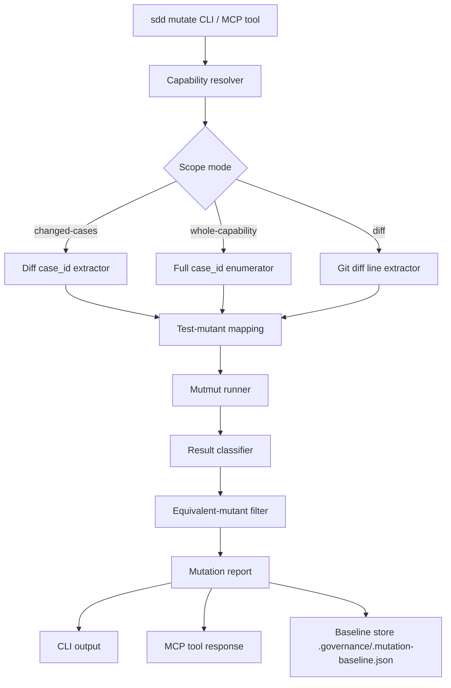

# Design specification — mutation-testing capability

> **Status**: roadmap (v0.4).
> **Capability spec**: [`spec.yaml`](./spec.yaml).
> **Research grounding**: [`research.md`](./research.md).
> **Author**: @mansura-habiba.

This document is the architectural design for the `mutation-testing` capability. The capability spec defines *what* must hold (contract, cases, definition of done, forbidden behaviors). This document defines *how* we build something that satisfies it.

---

## 1. The design problem in one sentence

Build a mutation-testing capability that turns surviving mutants — not scores — into the actionable artifact, runs fast enough for per-PR use by scoping to `case_id`-bound tests, and never blocks merges on absolute thresholds.

That sentence carries the whole design. Every architectural choice below either makes that sentence operationally true or it's a mistake.

---

## 2. Architecture overview



Six components, one orchestration layer, one persistence file. Nothing exotic.

**Capability resolver.** Reads `.governance/capabilities/<id>/spec.yaml`, extracts the `cases[].test_id` list and the implementation files they exercise (via pytest's collection + coverage.py).

**Scope mode** decides which subset of tests/lines mutmut will run against. The framework-native acceleration lives here: in `changed-cases` mode, we read the git diff, intersect changed files with the test_ids bound to case_ids, and pass only those tests + their covered lines to mutmut.

**Test-mutant mapping** is mutmut's existing functionality — we don't reimplement it. We just feed it the scoped paths.

**Mutmut runner** invokes mutmut with the operator set and the test scope. Operator selection is configurable per the spec's `operator_set` enum.

**Result classifier** categorizes each mutant: killed, survived, timed-out, errored. A timeout is not a kill — the spec's `forbidden` section calls this out explicitly.

**Equivalent-mutant filter** has two passes:
1. **Arid-line filter** — skip lines matching the arid-line rules (logging calls, `if x is None: return None` defensive patterns, trivial getters). Implemented as an AST visitor before mutation begins; mutmut never sees these lines.
2. **AST-normalization comparison** — for surviving mutants, parse original and mutated AST, normalize trivial syntactic differences (e.g. `i++` vs `i = i + 1` if Python had `++`, which it doesn't, but the same principle applies to chained vs unchained operators). Where the normalized ASTs match, the mutant is equivalent.

Neither pass uses an LLM. The spec forbids reaching for an LLM until classical methods are exhausted.

**Mutation report** is the output. JSON for machines (MCP tool response, CI), markdown for humans (CLI output). Both formats list surviving mutants first, score second.

**Baseline store** lives at `.governance/.mutation-baseline.json`, committed to the repo. Per-capability previous scores keyed by capability_id. Regression gating compares the current run against this file.

---

## 3. CLI surface

```bash
# Default — changed-cases scope, default operator set, prints markdown report.
sdd mutate <capability_id>

# Full capability sweep — nightly CI mode.
sdd mutate <capability_id> --scope whole-capability

# Diff scope — Google-style, ignores case_id linkage. Fallback for repos
# whose case_id bindings are incomplete.
sdd mutate <capability_id> --scope diff

# Rigorous operator set — adds SDL and CRCR. Slower, noisier, higher rigor.
sdd mutate <capability_id> --operators rigorous

# Update the baseline. Separate command because auto-updating on every
# passing run normalizes drift.
sdd mutate <capability_id> --update-baseline

# JSON output for CI pipelines.
sdd mutate <capability_id> --json
```

Exit codes:
- `0` — score stable or improved against baseline (or no baseline exists yet).
- `1` — score regressed against baseline. This is the only condition that blocks CI.
- `2` — execution error (unknown capability, mutmut failure, test suite broken). Distinct from regression.

---

## 4. MCP surface

The `sdd-governance` MCP server gains one new tool:

```python
mutate_capability(
    capability_id: str,
    scope: Literal["changed-cases", "whole-capability", "diff"] = "changed-cases",
    operators: Literal["default", "rigorous"] = "default",
) -> MutationReport
```

`MutationReport` shape, per the capability spec's `contract.outputs`:

```python
{
  "capability_id": "mutation-testing",
  "scope": "changed-cases",
  "operator_set": "default",
  "mutants_total": 47,
  "mutants_killed": 38,
  "mutants_equivalent": 4,
  "mutants_suppressed": 2,
  "mutants_survived": 3,
  "mutants_timeout": 0,
  "mutants_errored": 0,
  "score": 0.884,
  "baseline_score": 0.851,
  "regression_signal": "improved",
  "surviving_mutants": [
    {
      "file": "src/sdd/cli.py",
      "line": 142,
      "operator": "relational",
      "before": "if score >= threshold:",
      "after":  "if score > threshold:",
      "test_should_have_killed": "tests/contract/test_mutation_testing.py::test_detects_regression",
      "case_id": "detects-regression-against-baseline"
    }
  ],
  "suppressed_mutants": [
    { "file": "src/sdd/_runner.py", "line": 88, "marker": "# sdd: mutation-equivalent" }
  ]
}
```

Note `test_should_have_killed` and `case_id` — surviving mutants are linked back to the bound test and acceptance criterion. That's the framework-native value-add. Bob the Scaffolder can use this to recommend the specific test that needs strengthening; Dana the Reviewer can use it to gate task-card sign-off.

---

## 5. Operator selection

The capability spec's `operator_set` enum has two values. The internal mapping:

| operator_set | Includes (mutmut operators) | Excludes | Rationale |
|---|---|---|---|
| `default` | `ROR` (relational), `COR` (conditional), `NEG` (negation), `RVR` (return-value replacement) | `SDL`, `CRCR`, `AOR` (arithmetic) | Highest signal-to-noise per Beller et al. and PIT's DEFAULTS group. |
| `rigorous` | All of default plus `SDL`, `CRCR`, `AOR` | None | For capabilities where authors want maximum rigor and accept the equivalent-mutant tax. |

Arithmetic (`AOR`) is excluded from default because most arithmetic in production sdd code is either counters (high equivalent rate) or coordinate math (better tested by property-based tests, a different tool). Capabilities with heavy numeric logic should opt into `rigorous`.

---

## 6. Integration with the framework

### 6.1 Capability spec — `verifiable_by: mutation_score`

The capability_spec schema already supports `mutation_score` in `definition_of_done.conditions[].verifiable_by`. The mutation-testing capability is the first to wire that wiring up.

For a capability whose DoD has a `mutation_score` condition:

- `sdd validate` checks that the file referenced by `evidence_ref` exists (already implemented for `contract_test`).
- `sdd mutate <capability_id>` is the command that produces the evidence.
- `sdd doctor` adds a check: for every active capability with a `mutation_score` condition, the score is computed at least once per N days (configurable, default 7).

### 6.2 Bob the Scaffolder

Bob's `cases` block in capability specs is what's being audited. When Bob scaffolds a new capability with `verifiable_by: mutation_score`, he must:

- Recommend the `default` operator set unless the user explicitly asks for rigor.
- Include a starter `# sdd: mutation-equivalent` example in the scaffolded test file's preamble comment, so authors know the marker exists.
- Set a starter mutation score target in the DoD condition (`score >= 0.75`), with a comment that the threshold is guidance, not a hard gate.

The bob-scaffolder agent file gets a small addition in §3 ("Produce the full bundle in one pass") to know about this.

### 6.3 Dana the Reviewer

When Dana reviews a task card whose capability has `verifiable_by: mutation_score`, the review now includes:

- **Mutation score check** — run `sdd mutate <capability_id> --scope changed-cases` and surface the report.
- **Surviving-mutant analysis** — for each surviving mutant, evaluate whether it represents a missing assertion in the bound test or a genuinely equivalent mutant the author missed.
- **Regression gate** — if the score regressed against baseline, request changes. If it improved, that's a positive signal worth recording in the review notes.

The dana-reviewer agent file gets a new bullet under §3 ("Peer review against the contracts, not vibes") for this.

### 6.4 CI

A copy-pasteable GitHub Actions workflow ships under `.github/workflows/mutation.yml` as part of the capability's `definition_of_done`:

```yaml
name: mutation

on:
  pull_request:
    paths: ['src/**', 'tests/**', '.governance/**']

jobs:
  mutation:
    runs-on: ubuntu-latest
    steps:
      - uses: actions/checkout@v4
        with:
          fetch-depth: 0    # diff against base
      - uses: actions/setup-python@v5
        with:
          python-version: '3.11'
      - run: pip install 'sdd-plus-plus[mutate]'
      - name: Mutate changed cases per capability
        run: |
          for cap in $(sdd capabilities ls --status active --ids-only); do
            sdd mutate "$cap" --scope changed-cases --json > "mutation-$cap.json" || true
          done
      - name: Comment on PR
        uses: actions/github-script@v7
        # ... post the markdown report as a PR comment
      - name: Fail only on regression
        run: |
          for f in mutation-*.json; do
            jq -e '.regression_signal == "regressed"' "$f" && exit 1
          done
          exit 0
```

This is intentionally a recipe, not a turnkey action. Teams that want different gating (e.g. nightly full sweep) modify it.

---

## 7. Performance design

The capability spec's `non_functional.performance` requirement is: a 500-line / 50-test capability completes within 5x base test suite wall-clock time on a single machine.

The design choices that make this achievable:

- **Scope by case_id**, not by file. Even if a file has 1000 lines, we only mutate the lines covered by tests bound to changed case_ids. For most diffs, that's tens to low hundreds of lines.
- **Test-mutant mapping** via mutmut's built-in coverage analysis. Each mutant runs only the tests that cover the mutated line, not the full suite.
- **Per-case_id parallelism.** Each case_id's mutation run is independent. The runner spawns a worker per case_id up to `os.cpu_count() - 1`.
- **Mutmut's local cache.** Mutmut caches kill/survive results between runs keyed by source hash. Unchanged code skips re-mutation entirely.
- **Hard timeout per mutant.** Default 30 seconds. Mutants that timeout are reported separately and explicitly *not* counted as kills, per the spec's `forbidden` list.

If a capability exceeds the 5x budget on default scope, that's a signal to either split the capability or move it to a nightly full-sweep cadence. The framework doesn't try to optimize past that — beyond 5x, the right answer is reduced scope, not faster mutation.

---

## 8. Equivalent-mutant handling

Three layers, in order:

1. **Pre-mutation arid-line filtering.** Implemented as an AST visitor that runs *before* mutmut is invoked. Lines matching the arid patterns (logging.*, simple defensive null-returns, single-statement getters, dataclass auto-generated methods) are removed from mutmut's input. They're recorded in the report as "filtered: arid" so the count is visible.

2. **Inline suppression marker.** Authors annotate lines with `# sdd: mutation-equivalent <reason>` to suppress mutation on that specific line. The reason is mandatory — a marker without a reason fails validation. Suppressed lines appear in the report under `suppressed_mutants` with the reason text.

3. **Post-survival AST-normalization.** For surviving mutants only, the runner parses the original and mutated function, applies AST normalization (canonicalize operator chains, collapse redundant parens, sort kwarg order), and compares. Matches are classified `equivalent` and excluded from the denominator.

What we do **not** do, per the spec's `tasks_must.avoid_dependencies`:

- Do not invoke an LLM to detect equivalents until classical methods are exhausted. The 2024 arXiv work is promising but accuracy is below classical TCE.
- Do not silently drop suppressed or filtered mutants from the report. Suppression is visible by design.

---

## 9. Baseline management

The baseline file lives at `.governance/.mutation-baseline.json`. Schema:

```json
{
  "schema_version": "1",
  "capabilities": {
    "mutation-testing": {
      "baseline_score": 0.851,
      "operator_set": "default",
      "scope_at_baseline": "whole-capability",
      "recorded_at": "2026-05-20T14:32:00Z",
      "recorded_by": "@mansura-habiba",
      "recorded_commit": "a1b2c3d4..."
    }
  }
}
```

The baseline is per-capability, per-operator-set. Comparing a `default`-operators run against a `rigorous` baseline is meaningless, so the runner errors if they mismatch.

**Updates are explicit.** `sdd mutate <id> --update-baseline` is the only command that rewrites the file. The auto-update path is deliberately omitted: auto-updating on every passing run normalizes drift. Updates go through a human-authored commit, which makes drift visible in code review.

The file is committed. Yes, this means the baseline lives in git, with all the conflict-resolution headaches that implies. We accept that cost because the alternative — a side-channel store — is invisible and untrustable.

---

## 10. Failure modes the design handles

| Failure mode | How the design handles it |
|---|---|
| Flaky tests produce inconsistent kills | Three-run majority vote per mutant before classification. Configurable via `--retries`. |
| Test suite is broken before mutation runs | Runner detects pre-mutation test failure and exits with code 2 (execution error), not 1 (regression). The CI gate distinguishes. |
| Baseline file conflicts in a merge | Merge resolution is human-authored. Runner refuses to operate against a baseline file with merge conflict markers. |
| Capability has no bound tests | Runner exits with a clear error referencing the empty `cases[].test_id` fields, and refuses to score. |
| Mutmut crashes on a specific operator | Runner catches the crash, reports it under `errored`, and continues with remaining mutants. One bad operator does not abort the whole run. |
| Author games the score by adding trivial assertions | Out of scope — this is a social problem the framework cannot solve mechanically. Dana the Reviewer is the human gate. |

---

## 11. Open design questions

Listed in the capability spec's `notes.open_questions` and reproduced here with more space:

**Q1. Auto-update baseline?** No, by current design — auto-updating on every passing run normalizes drift. But this means the baseline can lag months behind reality if no one runs `--update-baseline`. Mitigation: `sdd doctor` warns when the baseline is more than N days old. Open question: what N?

**Q2. Inline marker vs spec block?** The `# sdd: mutation-equivalent` marker couples suppression to source code. Authors might prefer declaring equivalent mutants in the capability spec itself under a `mutation:` block. Both have advantages: inline is local and visible at the suppression site; spec block is centralized and reviewable in one place. The current design ships inline first; the spec block is a v0.5 addition if there's demand.

**Q3. Property-based mutation testing.** Bartocci et al. 2023 is the closest published prior art to what we're building. Worth a v0.5 spike: integrate with hypothesis so the mutation runner can drive property-based tests, not just example-based tests. Likely a large amplification of signal.

**Q4. LLM-based equivalent detection.** The 2024 arXiv work is promising but accuracy below classical TCE. Reassess in 12 months. If accuracy improves to ~90%+, integration becomes worth designing.

---

## 12. Non-goals — what this capability does not do

Explicit to prevent scope creep:

- **Does not produce a single number on a dashboard.** Surviving mutants are the deliverable. The score is a summary.
- **Does not block PRs on absolute thresholds.** Only regression against baseline can block.
- **Does not run mutation testing on integration or end-to-end tests.** Those are too slow and the test-mutant mapping degrades. Limit to unit and contract tests.
- **Does not attempt to fix surviving mutants automatically.** Mutation testing is a diagnostic; humans (or Bob, with human review) strengthen the tests.
- **Does not replace coverage.** Coverage is necessary for mutation testing to work — you need lines executed before you can mutate them meaningfully. Both metrics ship.

---

## 13. What ships in v0.4

Minimum viable capability:

1. `sdd mutate <capability_id>` CLI with `--scope`, `--operators`, `--update-baseline`, `--json` flags.
2. `mutate_capability` MCP tool with the same surface.
3. Arid-line filter, inline `# sdd: mutation-equivalent` marker, AST-normalization equivalent detection.
4. Per-capability baseline at `.governance/.mutation-baseline.json`.
5. Contract tests for each acceptance case in the capability spec.
6. Mutation score on the mutation-testing capability itself ≥ 0.75 (eating our own dog food — the spec's `meets-own-mutation-score` DoD condition).
7. Sample GitHub Actions workflow at `.github/workflows/mutation.yml`.
8. Updates to Bob and Dana agent files to know about the new `verifiable_by: mutation_score` capability.
9. README section and updated PLUGIN.md.

What's explicitly **deferred** to v0.5+:

- Property-based mutation testing integration.
- LLM-based equivalent detection.
- Spec-level (non-inline) suppression declarations.
- Cross-capability mutation testing dashboards.
- Cosmic-ray as an optional execution engine.

---

## Appendix A — Why not cosmic-ray as default

cosmic-ray has a broader operator set, supports distributed execution via Celery, and has academic credibility. We're not picking it because:

- Configuration burden is higher (TOML spec file, explicit operator selection). Adopters pay for flexibility they don't need.
- Maintenance signal is weaker (1.1.0a1 alpha 2025 vs mutmut 3.3.0 stable May 2025).
- Distributed execution is genuinely powerful but only matters at scales where mutmut's per-machine concurrency caps out. Most adopters won't reach that scale.
- Pytest integration is more work to wire up.

Document cosmic-ray as the power-user fallback. Don't ship it as default.

## Appendix B — Why not MutPy

Strongest academic operator catalog of any Python mutation tool. Excluded because the maintenance signal is too weak — last release tagged years ago, issues open without responses. Recommending it to other teams would be malpractice. If the maintainer situation changes, reconsider.

## Appendix C — On framing the score

The mutation score is a side-effect of the work, not the work itself. The work is finding the surviving mutants and strengthening the tests that should have killed them. Every UI surface, every report, every CI message should foreground the surviving mutants and de-emphasize the score. The score is a check that test quality hasn't slipped; it is not a quality target.

If this design makes the score the headline, we got it wrong.
