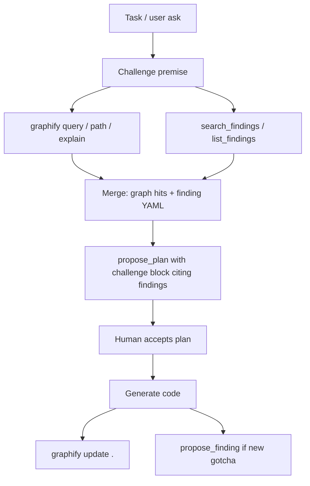

# Design note: Graphify × LLM wiki (SDD++)

> Status: proposal (human to accept before productizing).  
> Related: [GRAPHIFY-1](../tasks/GRAPHIFY-1.md), issue [#5](https://github.ibm.com/MANSURAH/sdd-plus-plus/issues/5)  
> Date: 2026-07-23

## Verdict

**Yes — Graphify makes the LLM wiki *better to search*, but it must not *become* the wiki.**

| Layer | Owner | Job |
|---|---|---|
| **Authority** | SDD++ findings + wiki sync | Schema, `suspected→confirmed`, write_policy, human signatures, provenance |
| **Retrieval** | Graphify | Cheap cross-link search: finding ↔ capability ↔ code ↔ doc |

Substring `search_findings` answers “does this string appear?”  
Graphify answers “what is *connected* to this?” — which is what assistants need before generating code.

## Why the current wiki is weak for AI (alone)

Today’s intended AI path:

1. `list_findings(capability=…)` / `search_findings(query)`
2. Read matching YAML

Gaps:

- **No structure.** `related_findings` / `related_capabilities` are fields, but search does not walk them.
- **No code bridge.** A finding about auth cookies does not surface `src/.../session.py` unless the text happens to name it.
- **Token cost.** Dumping many findings into context is expensive; Graphify’s scoped subgraph is designed for that (order-of-magnitude fewer tokens vs raw corpus).
- **Org wiki still unread.** Even after Phase A (`wiki pull` + merged search), retrieval stays keyword-shaped. Sync ≠ navigation.

## How Graphify helps the wiki

Index the wiki corpus (local `.governance/wiki/` + pulled `wiki.local_cache`) into `graph.json`:

```
finding:auth-cookie-samesite
    --related_to--> capability:auth
    --mentions--> SessionMiddleware
    --related_to--> finding:csrf-double-submit
    --sourced_from--> wiki/findings/auth-cookie-samesite.yaml
```

Assistants then:

| Need | Tool |
|---|---|
| Exact finding by id / filter by status | `get_finding` / `list_findings` (SDD) |
| “Anything like this gotcha?” | `graphify query "…"` then `get_finding` on hits |
| “What code does this finding touch?” | `graphify path "finding:X" "ClassY"` |
| “If we change X, which findings matter?” | `graphify affected "X"` |

**Challenge:** Replacing findings YAML with Graphify-only storage would break AI-resistance (status history, human confirm). Graphify edges are EXTRACTED/INFERRED/AMBIGUOUS — fine for retrieval, not for governance authority.

## How an AI assistant (Cursor / Claude / Copilot) benefits via SDD++

Ideal session loop (once wired):



Concrete benefits:

1. **Fewer rediscovered gotchas** — graph neighbors of the active capability show up even when keywords don’t match.
2. **Better challenge blocks** — plans cite *related* findings with evidence paths, not only substring hits.
3. **Cheaper context** — pull a 20-node subgraph instead of reading the whole wiki.
4. **Multi-repo org knowledge** — `wiki.repo` syncs YAML; `graphify global` / merged graphs connect those findings to code across repos (matches the user’s Graphify workspace rule).
5. **Still governed** — AI may only `propose_finding` as `suspected`; Graphify never “confirms” anything.

## Recommended product shape (for a future accepted plan)

Do **not** hard-depend Graphify in `sdd-plus-plus`. Optional companion + thin MCP facades:

| MCP tool (proposed) | Behavior |
|---|---|
| `kb_query(question)` | Prefer Graphify if `graphify-out/graph.json` (or config path) exists; else fall back to `search_findings` |
| `kb_path(a, b)` | Wrap `graphify path` |
| `kb_explain(concept)` | Wrap `graphify explain` |
| existing `search_findings` | Keep; authoritative for status/tag filters |

Config sketch (human to decide):

```yaml
knowledge:
  graphify:
    enabled: true
    graph_path: graphify-out/graph.json   # or ~/.graphify/global-graph.json
    index_wiki: true                      # include wiki cache in extract
    refresh: on-pull                      # rebuild after sdd wiki pull
```

Hooks:

- After `sdd wiki pull` → `graphify update <wiki_cache>` (or extract with LLM for YAML/docs)
- After commit → existing `graphify hook` for code AST
- `sdd init` → optional hint + Cursor rule template (not forced)

## What to keep separate

| Keep in SDD++ | Keep in Graphify |
|---|---|
| Finding schema + lifecycle | Edge extraction / clustering |
| `write_policy` / wiki git sync | Token-budgeted traversal |
| Contract tests on YAML | `graph.html` / wiki articles for humans |
| AI cannot confirm findings | INFERRED edges (labeled as such) |

## Immediate dogfood (no new product code)

1. Semantic-index `.governance/wiki/` (+ docs) with `/graphify --update` when an LLM backend is available.
2. Keep using `search_findings` for status-aware lookups.
3. Use `graphify query` in challenge-before-comply for architecture and cross-finding links.
4. Promote to MCP wrappers only after a human-authored capability spec + accepted plan.

## Open questions for @mansura-habiba

1. Should org-wide wiki graphs be **per-wiki-repo** or merged into **one global graph** with repo tags?
2. Is `kb_query` an MCP tool on `sdd serve`, or do we document “install Graphify + Cursor rule” only?
3. After `wiki pull`, is graph refresh **automatic** or **explicit** (`sdd wiki pull --reindex`)?
