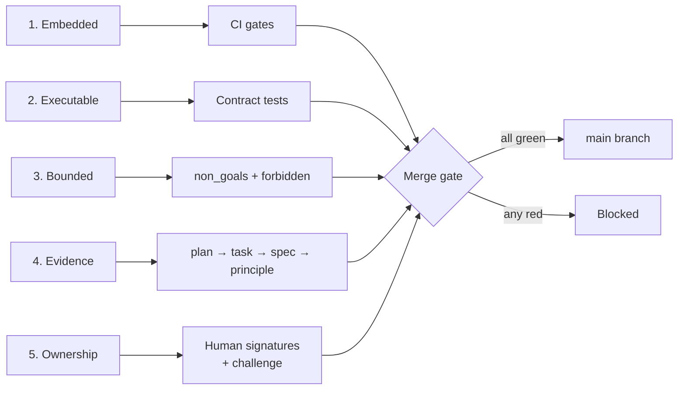

# Principles

> One page. Five principles. Every PR, every spec, every plan, every line of AI-generated code in this repo respects them. The framework enforces them mechanically.

---

## 1. Governance is embedded, not sidecar

**In practice:** Rules live in this repo (`.governance/`), run in this CI, gate this merge button. There is no separate "governance system" you log into.

**Violation looks like:** A wiki page titled "Engineering Standards" nobody reads. A code-review checklist in a Confluence doc. A manual approval gate in a separate tool.

**Enforced by:** `.github/workflows/governance.yml` runs on every PR. Schema validators are pytest under `tests/contract/`, the same suite developers run locally.

---

## 2. Specs are executable contracts, not prompt snippets

**In practice:** Every capability has a machine-readable spec (`capabilities/<id>/spec.md` with YAML frontmatter) and an executable test suite. The frontmatter is the contract; the tests are the proof. AI-generated tests must satisfy named cases, not invent their own.

**Violation looks like:** A markdown file describing what a function "should" do, with prose that can be reinterpreted. AI-generated unit tests that assert what the code already does. A "spec" that is actually a long Slack thread.

**Enforced by:** `spec.md` frontmatter is JSON-Schema validated. Task cards and plans reference specific case IDs. Tests trace to case IDs via `# case_id:` comments. Orphan assertions fail the lint.

---

## 3. Authority must be bounded

**In practice:** Every plan declares what it does NOT do. Every spec lists forbidden behaviors. Every task gives the AI a paths-it-cannot-touch list. Authority is granted in writing, with limits, before work begins.

**Violation looks like:** A senior "improving" adjacent code while implementing the assigned feature. An AI's diff that's 4x the size of the issue. A scope expansion discovered only at review time.

**Enforced by:** Plan schema requires `non_goals` (minItems: 1). Spec frontmatter requires `forbidden` (minItems: 1). CI compares PR diff against `do_not_modify` paths and fails if violated.

---

## 4. Evidence is required for trust

**In practice:** Every merged change traces to a plan. Every plan traces to a task and a capability spec. Every capability traces to a principle. The chain is auditable, not promised. Findings (`wiki/findings/`) accumulate as the team learns and feed back into the spec.

**Violation looks like:** A PR with no linked issue. A merge with "trust me, I tested locally." A capability shipped without anyone able to point at where it was scoped.

**Enforced by:** PR template requires task and plan IDs. CI requires test linkage to case_ids. Findings have machine-readable metadata so `sdd serve` can surface them to the AI before it generates code in a related area.

---

## 5. AI is a collaborator, not an author

**In practice:** AI writes code, drafts plans, surfaces findings. Humans *own* specs, *own* plans (via explicit acceptance), and *own* every merged line. AI is required to challenge weak premises before complying — sycophancy is a failure mode, not a feature.

**Violation looks like:** An AI-generated spec that nobody verified. A plan marked accepted without a human signature. A PR that says "AI did it" when asked who's responsible. An AI that produces code on every request without ever pushing back.

**Enforced by:**
- `spec.md` frontmatter requires `owner.human` (cannot be an AI handle).
- `plan.md` frontmatter requires `accepted_by` (human handle) before status can be `accepted`. AI cannot self-accept.
- `plan.md` frontmatter requires a `challenge` block (understood_request + concerns + alternatives_considered) before the plan is even saved as draft.
- PR template requires an explicit human ownership statement before merge.
- `instructions.md` mandates challenge-before-compliance as a default AI behavior.

---

## How the principles connect

---

## Reading this doc

- **Junior engineer:** read the five principles. After that, `.governance/instructions.md` and the GitHub issue form will tell you what to do. The framework enforces the principles — you don't memorize them.
- **Senior engineer:** these are your design constraints when authoring specs. Violations you introduce will surface in CI.
- **Reviewer:** judgment calls only. Compliance is a CI concern; your review focuses on architectural fit, business sense, and edge cases the contract tests don't catch.
- **AI assistant:** see `.governance/instructions.md`. The principles above bind you in the same way they bind humans, with the additional constraint that you may not author specs or accept plans — only humans can.
