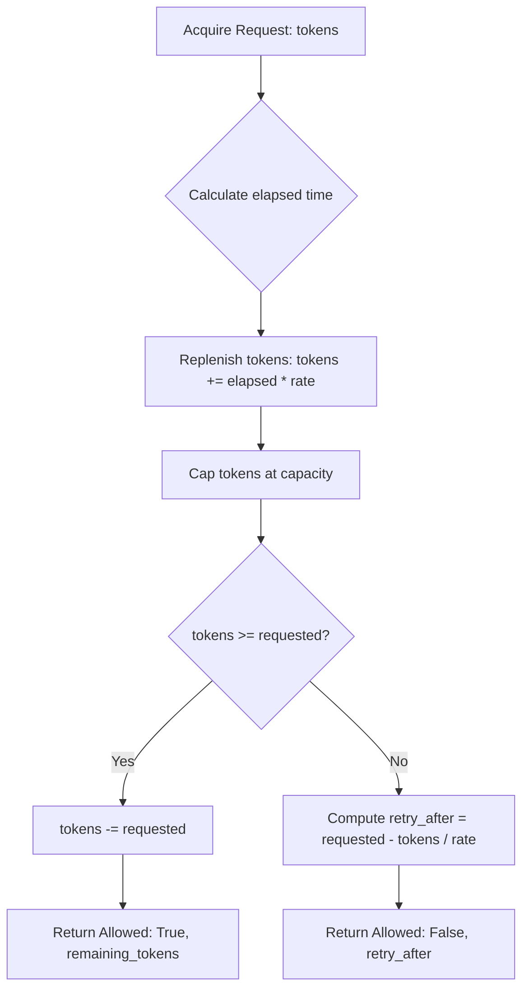

# Design Document: Token Bucket Rate Limiter

## 1. Overview
The `rate-limiter` capability provides deterministic, thread-safe in-memory rate limiting based on the Token Bucket algorithm. It allows services to meter resource consumption by granting permits when tokens are available and computing backoff durations (`retry_after`) when exhausted.

## 2. Algorithm & State Model

### State Fields
- `capacity: float` — maximum bucket capacity.
- `rate: float` — replenishment rate in tokens per second.
- `_tokens: float` — currently available tokens in bucket `[0.0, capacity]`.
- `_last_updated: float` — monotonic timestamp (`time.monotonic()`) of last state transition.
- `_lock: threading.Lock` — re-entrant/mutual exclusion lock for thread safety.

## 3. Key Invariants & Safeguards
1. **Monotonic Clock**: Always uses `time.monotonic()` instead of `time.time()` to guard against wall-clock skew and NTP time steps.
2. **Atomic Deduction**: Check and deduction happen under the lock; no intermediate state is visible.
3. **All-or-Nothing**: If a request asks for 5 tokens and only 4 are present, 0 tokens are deducted and the request is rejected with calculated backoff time.
