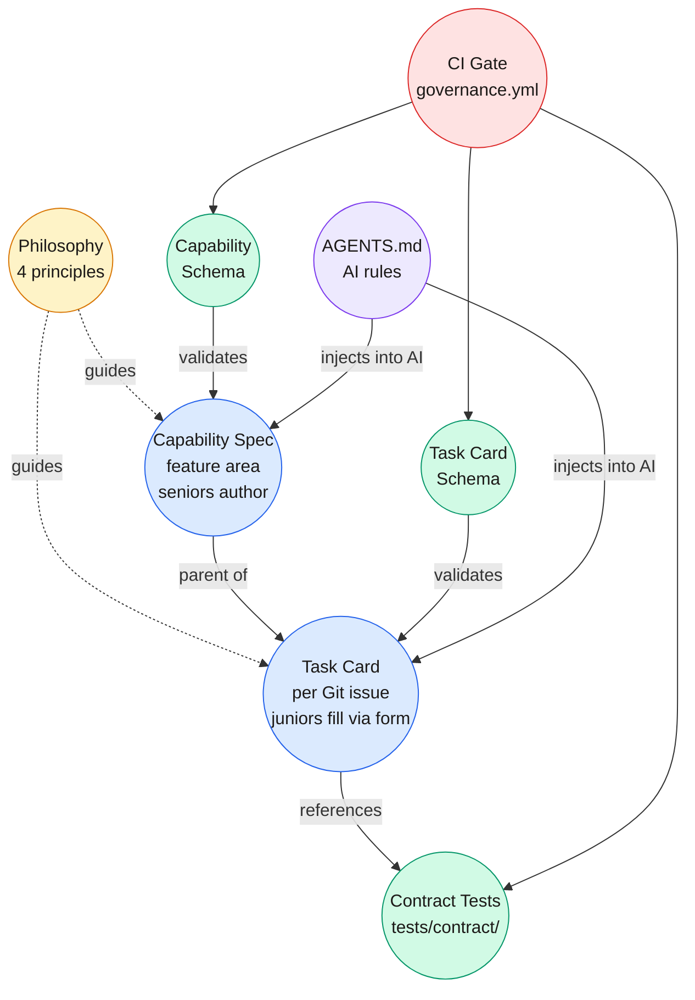
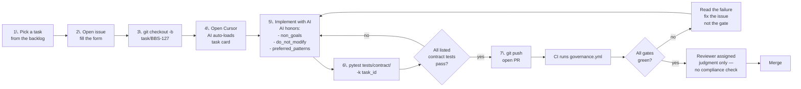
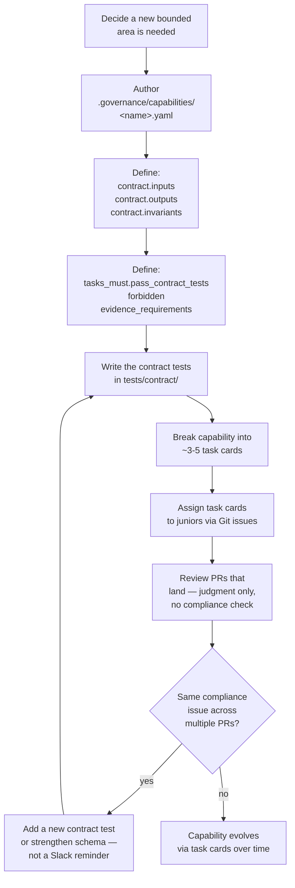
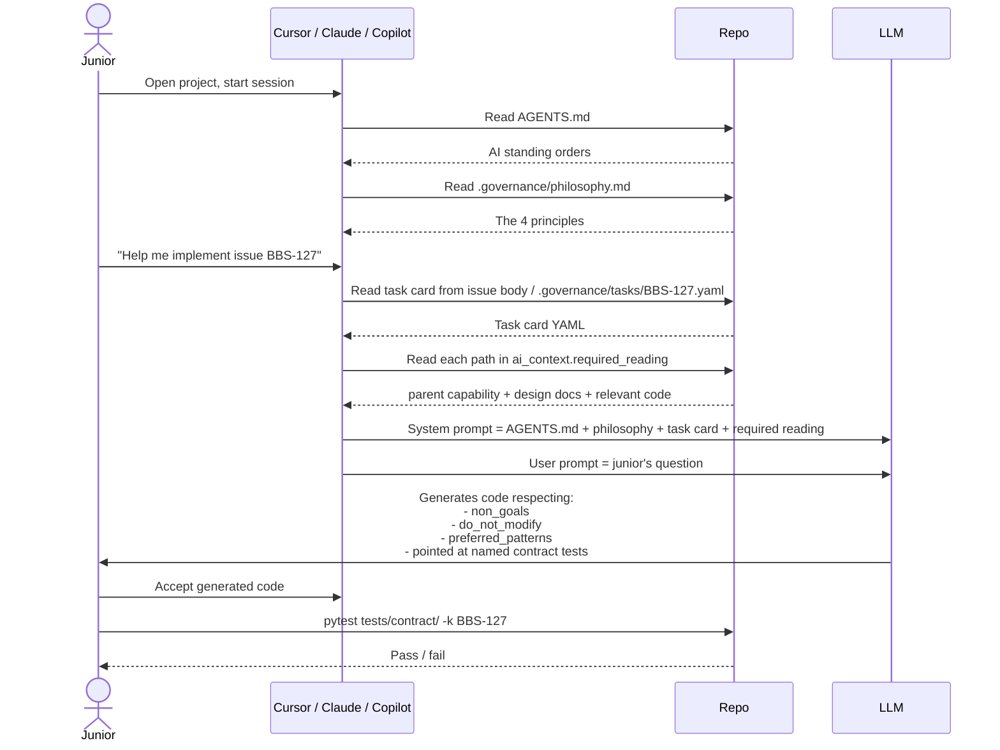
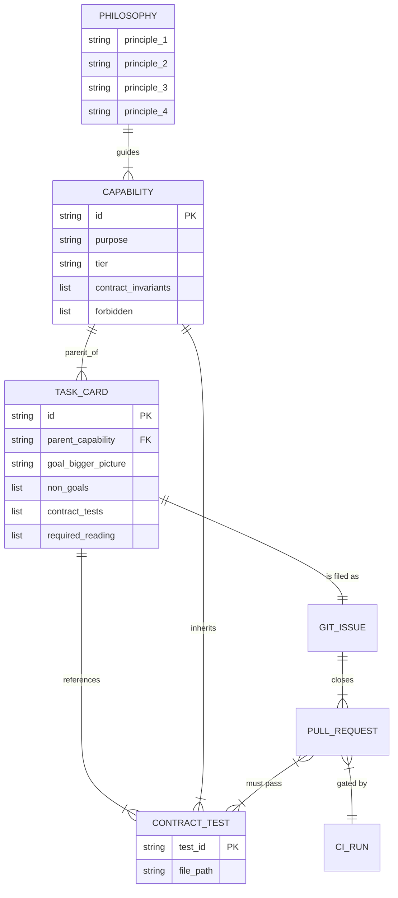
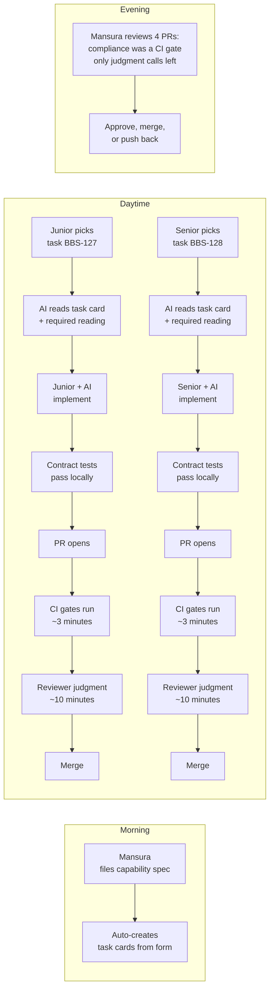

# Framework diagrams

> Visual references for the governance framework. All diagrams are Mermaid — they render natively in GitHub, GitLab, Cursor, VS Code (with the Mermaid extension), and Obsidian. Use for onboarding, all-hands slides, or pinning in Slack.

---

## 1. The four-file mental model (bubble view)

**Reading it:** the **yellow bubble at the top** is the philosophy — it shapes everything. **Blue bubbles** are what humans write. **Green bubbles** are what machines read. **Purple bubble** is the AI integration point. **Red bubble** is the CI gate. Arrows show dependency.

---

## 2. Junior workflow (the happy path)

**The junior never:** writes YAML by hand. Memorizes the framework. Worries about whether they "did governance." The form, the AI rules, and CI do that work.

---

## 3. Senior workflow (designing a capability)

**The senior never:** spends review time on compliance. Writes the same correction twice without it becoming a contract test. Holds context in their head that the framework could hold for them.

---

## 4. What happens when an AI session starts

**Key insight:** by the time the AI sees the junior's question, the task card and all required reading are already in its context window. The AI cannot "forget" to honor the spec, because the spec is right there.

---

## 5. Entity relationships

---

## 6. What the team sees on a typical day

**The lever:** reviewer time per PR drops from "read every line, check compliance" to "10 minutes of judgment." Multiplied across a team of 6 engineers shipping 8 PRs/week, that's the difference between drowning in reviews and managing a team.
