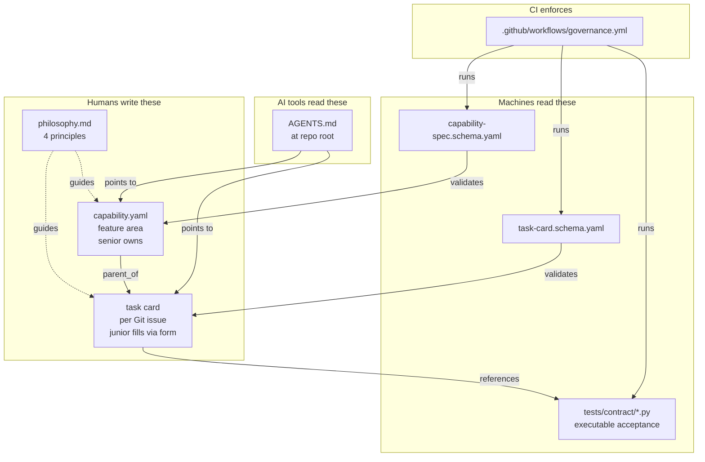
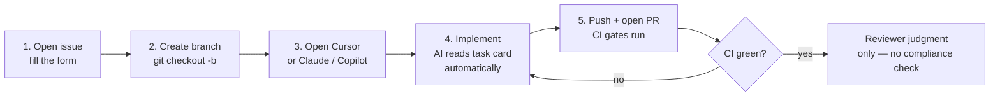

# .governance — start here

> **For juniors:** read this once. After that, the framework guides you through forms and CI checks. You won't need to memorize anything.
>
> **For seniors:** the framework's job is to externalize the context you usually keep in your head. The minute you find yourself reviewing a PR for compliance instead of judgment, something here is misconfigured — open an issue.

---

## The 60-second mental model



Four kinds of files, four kinds of work. Humans write the top row. Machines validate the middle. AI assistants read the bottom-left. CI is the gate on the right.

---

## Your first task as a junior — 5 steps



### Step 1 — Open the issue using the form

Go to GitHub → New Issue → pick **"Task Card"**. The form has guided fields (one-liner, bigger picture, in-scope, **non-goals**, contract tests, required reading for AI). Fill every field. The form generates a populated YAML in the issue body.

**Why every field matters:** the AI in step 3 reads this. If you skip the non-goals field, the AI will happily build five extra things. If you skip required-reading, the AI will hallucinate names that don't exist in our codebase.

### Step 2 — Create your branch

Standard: `git checkout -b task/BBS-127`. The branch name should include the task ID so CI can cross-reference.

### Step 3 — Open your AI assistant

The repo already has `AGENTS.md` at the root. Cursor, Claude Code, and GitHub Copilot all load it automatically. It tells your AI:

1. Read this task's card before generating any code.
2. Read the files in `ai_context.required_reading`.
3. Don't invent test names — use the IDs in `acceptance.contract_tests`.
4. Don't touch paths in `ai_context.do_not_modify`.

You don't have to remember any of this. The AI does, because the rules are in its context window.

### Step 4 — Implement

Ask the AI to implement the task. It will use the task card as the contract. Your job:

- **Read the AI's output before accepting it.** Especially: did it touch anything in `do_not_modify`?
- **Run the contract tests locally:** `pytest tests/contract/ -k <test_id>`. If they fail, push back to the AI with the failure.
- **Run `pre-commit run`** if it's installed. It validates the task card YAML and checks the diff against `non_goals`.

### Step 5 — Push and open the PR

The PR template will ask you to:

- Link the task card (`Closes #127`)
- List which contract tests now pass
- Confirm you didn't expand scope beyond the task card

CI runs `.github/workflows/governance.yml`. It validates the task card, runs every listed contract test, and checks that the diff doesn't touch forbidden paths. **You don't get a reviewer until CI is green.**

The reviewer's job is judgment, not compliance — architecture fit, business sense, edge cases. Compliance is the bot's job.

---

## What seniors do differently

You skip the issue form and write the task card YAML directly, often as part of breaking down a capability you authored. You also:

- Author capability specs (`.governance/capabilities/<name>.yaml`) when introducing a new bounded area.
- Set `tasks_must.pass_contract_tests` — the regression gates every task in your area inherits.
- Set `forbidden` — the capability-level non-goals everyone in your area must respect.
- Review PRs for judgment. Compliance failures are CI's problem, not yours.

When you find yourself fixing the same compliance issue across three juniors' PRs, that's a signal to add a contract test, not to write a Slack reminder.

---

## Common mistakes (and what the framework does about them)

| Mistake | What used to happen | What the framework does |
|---|---|---|
| Skipping the design doc | Multiple review cycles, junior re-does the work | AI loads the task card automatically; not reading it is now AI's failure, not the engineer's |
| AI tests please the code, not the spec | Tests pass, behavior wrong | `acceptance.contract_tests` is required; AI satisfies named tests, doesn't invent new ones |
| Junior misses related issues / duplicates work | Two engineers write the same thing | Task card requires `links.related_issues`; form lints for orphan tasks |
| Senior overbuilds | Code we don't need ships | `scope.non_goals` is required with `minItems: 1`; PR diff is checked against it |
| Performance ignored | Slow merge, fixed in P2 | `non_functional.performance` required at tier `org`+; defaults declared on capability |
| "I told them the end goal" (only in your head) | Wrong direction shipped | `goal.bigger_picture` required, `minLength: 50` — forces actual sentences |

---

## File index

```
.governance/
├── philosophy.md                       ← read this once
├── README.md                           ← this file
├── capability-spec.schema.yaml         ← schema for capabilities (senior writes)
├── task-card.schema.yaml               ← schema for tasks (junior fills via form)
├── capabilities/
│   └── skill-registry.yaml             ← example capability instance
├── examples/
│   └── task-card.example.yaml          ← example task card
└── tests/contract/                     ← executable acceptance tests
    └── test_task_card_validates.py     ← v0.1: validates every task card

(at repo root)
AGENTS.md                               ← AI rules — all AI tools load this
.github/
├── ISSUE_TEMPLATE/
│   └── task-card.yml                   ← the form you fill in for a new issue
├── pull_request_template.md            ← the PR checklist
└── workflows/
    └── governance.yml                  ← the CI gate
```

---

## When the framework gets in your way

It will, occasionally. The expected response is to file a `chore` task card to fix the framework — never to bypass it. Bypasses get the rule embedded harder; fixes get the rule embedded better.
