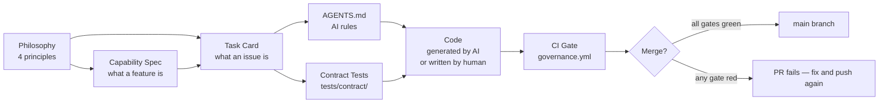

# Governance Philosophy

> One page. Four principles. Every PR in this repo respects them, and the framework enforces them mechanically.

## The four principles

### 1. Governance is embedded, not sidecar

**In practice:** The rules live in the same repo as the code, run in the same CI as the build, and gate the same merge button. There is no separate "governance system" you log into.

**Violation looks like:** A wiki page titled "Engineering Standards" that nobody reads. A code-review checklist in a Confluence doc. Manual approval steps in a separate tool.

**How we enforce it:** `.github/workflows/governance.yml` runs on every PR. The schema validators and contract tests are pytest under `tests/contract/`, the same suite developers run locally.

---

### 2. Skills are executable contracts, not prompt snippets

**In practice:** Every capability has a machine-readable schema (`.governance/capability-spec.schema.yaml`) and an executable test suite (`tests/contract/`). The schema is the contract; the tests are the proof.

**Violation looks like:** A markdown file describing what a function "should" do. AI-generated unit tests that assert what the code already does (rather than what the spec requires). A "specification" that's actually a long Slack thread.

**How we enforce it:** Task cards reference specific test IDs via `acceptance.contract_tests`. CI fails if any listed test fails. AI-generated tests don't satisfy this gate — they have to make the named contract test pass, not invent their own.

---

### 3. Authority must be bounded

**In practice:** Every task card declares what it does NOT do (`scope.non_goals`) and what AI cannot modify (`ai_context.do_not_modify`). Authority is granted in writing, with limits, before work begins.

**Violation looks like:** A senior engineer "improving" adjacent code while implementing the assigned feature. A junior's AI generating a refactor that wasn't asked for. A PR diff that's 4× the size of the issue.

**How we enforce it:** `scope.non_goals` has `minItems: 1` — you cannot file a task without writing at least one bounding constraint. CI compares the PR diff against `do_not_modify` paths and fails if violated.

---

### 4. Evidence is required for trust

**In practice:** Every merged change traces back to a task card. Every task card traces back to a capability. Every capability traces back to a principle. The chain is auditable, not promised.

**Violation looks like:** A PR with no linked issue. A merge with "trust me, I tested it locally." A capability built without anyone being able to point to where it was scoped.

**How we enforce it:** PR template requires the task card ID. CI requires `acceptance.contract_tests` to be a non-empty list. Reviewer's checklist confirms the chain before approving.

---

## How the principles connect

## Reading this doc

- **If you're a junior engineer:** read the four principles, then go to [`.governance/README.md`](README.md). You will not be asked to memorize this — the framework enforces it.
- **If you're a senior engineer:** the principles are your design constraints when authoring capability specs. Violations you introduce will surface in CI, not in tribal knowledge.
- **If you're a reviewer:** judgment calls only. Compliance is a CI concern; your review focuses on architectural fit, business sense, and edge cases the contract tests don't catch.
